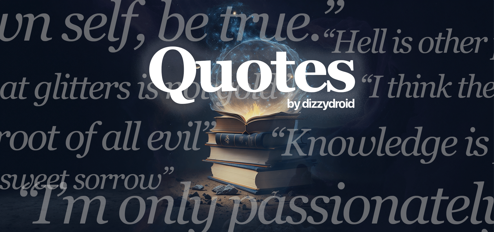

# “𝐐𝐮𝐨𝐭𝐞𝐬”

 

<pre align = "center"> <b> 
<a href="https://dizzydroid.github.io/quotes/">Find your next favorite Quote!</a> </b>
</pre>

A simple website that generates a random quote using the [Quotable API](https://docs.quotable.io/docs/api)

______________________________________
### Known issues: 
- ~~It takes too long loading the site on the **first** visit, it's mainly becuase of how the API is fetched. I intend on fixing that soon!~~
- ~~If the frequency of "dizzydroid favorite" quotes is somewhat high, it's due to the API fetching and is likely a one-time issue as well.~~
- If the "Loading..." screen takes some time, it's likely a one-time server side issue and is usually on first visits only.
- [Report any issues you encounter!](https://github.com/dizzydroid/quotes/issues)
___________________________________________________________

 This web-app is part of the <a href = "https://dizzydroid.github.io/blog.html">DizzyBlog</a> © dizzydroid. All rights reserved 

